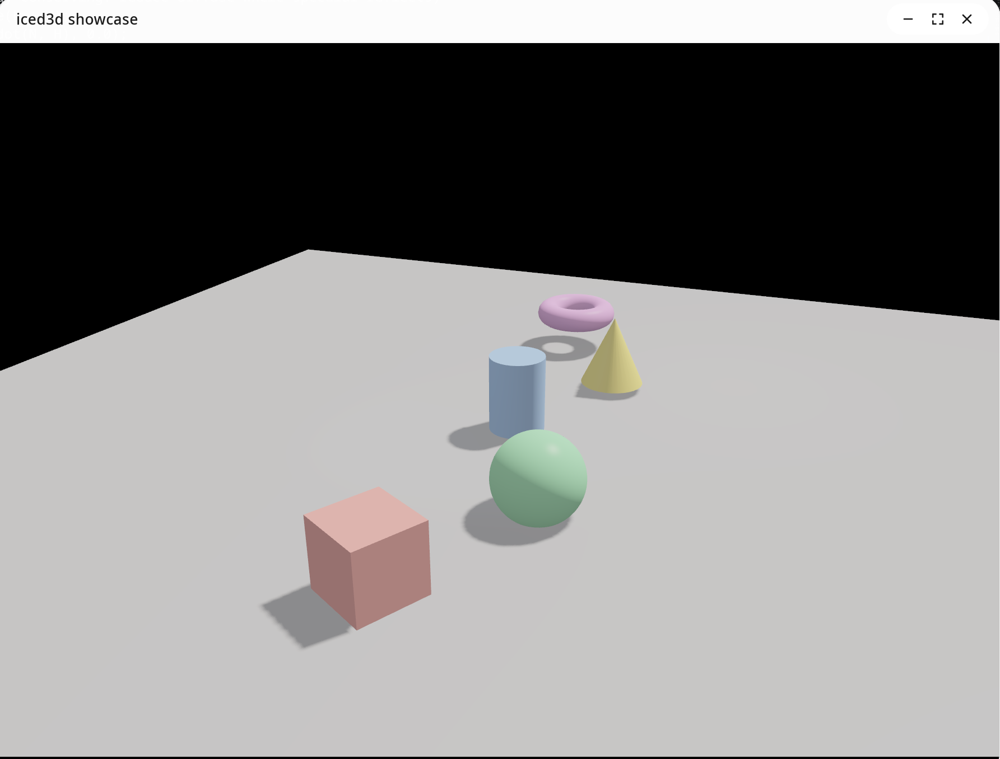
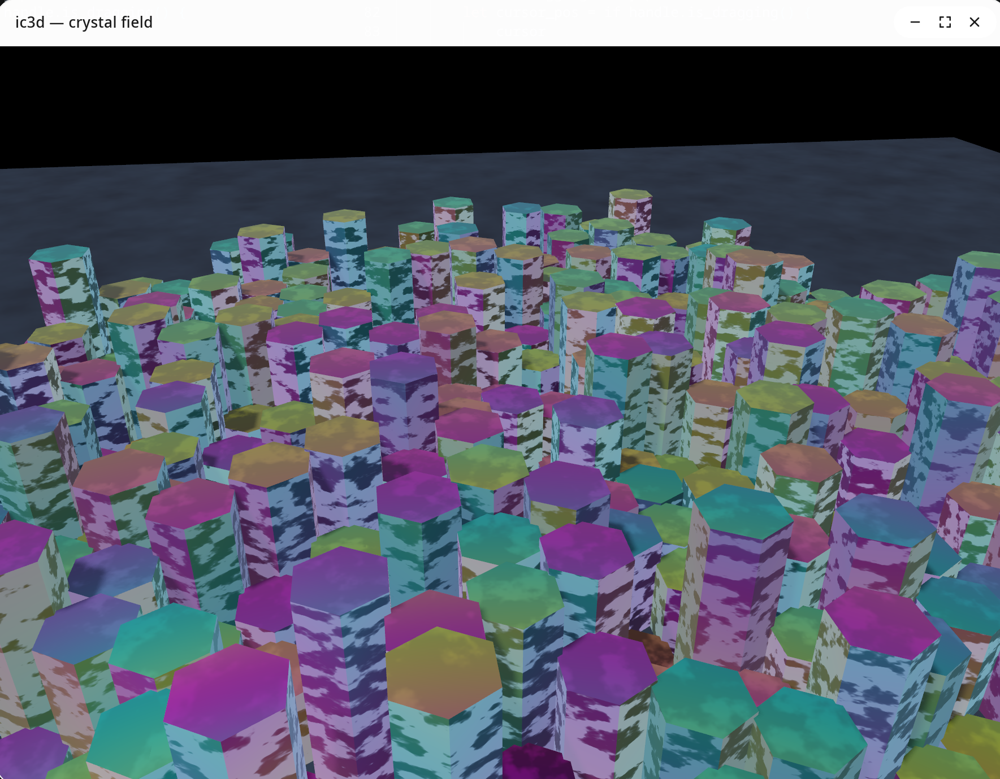

# ic3d

Lightweight 3D instanced rendering for [iced](https://iced.rs) applications. Shadow mapping, configurable MSAA, camera/light/mesh abstractions, and reusable WGSL shader preludes. Consumers write only a fragment shader.




## Quick Start (Scene Graph)

The simplest path — build a `SceneGraph` with camera, lights, materials, and meshes. It implements `Scene3DProgram` automatically:

```rust
use ic3d::graph::{SceneGraph, Material, AmbientLight};
use ic3d::widget::scene_3d;
use ic3d::{Mesh, PerspectiveCamera, DirectionalLight};
use ic3d::glam::Vec3;

let mut graph = SceneGraph::new();

// Materials
let red = graph.add_material(Material::new(Vec3::new(0.8, 0.2, 0.2)).with_shininess(64.0));

// Camera
graph.add_camera(PerspectiveCamera::new()
    .position(Vec3::new(0.0, 2.0, 5.0))
    .target(Vec3::ZERO)
    .clip(0.1, 50.0));

// Lights
graph.add_light(DirectionalLight::new(
    Vec3::new(-0.5, -1.0, -0.3).normalize(), Vec3::ZERO, 15.0, 30.0));
graph.add_light(AmbientLight::new(0.15));

// Meshes with hierarchy
let body = graph.add_mesh("body", Mesh::cube(1.0))
    .material(red)
    .position(Vec3::new(0.0, 1.0, 0.0))
    .id();
let _arm = graph.add_mesh("arm", Mesh::cube(1.0))
    .material(red)
    .parent(body)
    .position(Vec3::new(0.9, 0.3, 0.0))
    .scale(Vec3::new(0.8, 0.2, 0.3))
    .id();

// In view() — graph implements Scene3DProgram directly:
scene_3d(graph.clone()).width(Length::Fill).height(Length::Fill)
```

Mutate the scene at runtime via `graph.node_mut(id)` and `graph.camera_mut::<PerspectiveCamera>(cam_id)`.

## Advanced: Custom Scene3DProgram

For full control (custom fragment shaders, custom uniforms, manual instance transforms), implement `Scene3DProgram` directly:

```rust
use ic3d::widget::{scene_3d, Scene3DProgram, Scene3DSetup, MeshDrawGroup};
use ic3d::{Scene, PerspectiveCamera, DirectionalLight, Mesh, Transform};
use ic3d::glam::Vec3;

#[derive(Debug)]
struct MyScene { time: f32 }

impl Scene3DProgram for MyScene {
    fn setup(&self, bounds: iced::Rectangle) -> Scene3DSetup {
        let camera = PerspectiveCamera::new()
            .position(Vec3::new(0.0, 2.0, 5.0))
            .aspect(bounds.width / bounds.height.max(1.0));
        let sun = DirectionalLight::new(
            Vec3::new(-0.5, -1.0, -0.3).normalize(),
            Vec3::ZERO, 15.0, 30.0,
        );
        let scene = Scene::new(&camera).light(&sun).ambient(0.15).time(self.time).build();
        let cube = MeshDrawGroup::new(
            Mesh::cube(1.0),
            vec![Transform::new().to_instance([0.8, 0.2, 0.2, 64.0])],
        );
        Scene3DSetup { scene, draws: vec![cube], overlays: vec![], custom_uniforms: None }
    }
}

// In view():
scene_3d(MyScene { time: elapsed }).width(Length::Fill).height(Length::Fill)
```

Override `fragment_shader()` to replace the default Blinn-Phong, `custom_uniforms_size()` for `@group(1)` data, and `post_process_factory()` for screen-space effects.

## Low-Level Pipeline API

For full control, use `compose_shader()` + `RenderPipeline3D` directly:

```rust
let shader = ic3d::compose_shader(include_str!("my_fragment.wgsl"));
let pipeline = RenderPipeline3D::new(device, format, &shader, PipelineConfig::default());

// Per frame:
let scene_data = Scene::new(&camera)
    .light(&sun)
    .light(&point_light)
    .ambient(0.15)
    .time(elapsed)
    .screen_size(width, height)
    .build();

pipeline.prepare_scene(device, queue, bounds, &scene_data, &instances);

let cube = Mesh::cube(1.0).upload(device);
pipeline.render(encoder, target, bounds, &[
    pipeline.draw(&cube, 0..instance_count),
], None);
```

## GPU Bind Groups

| Group | Binding | Owner    | Contents                                          |
|-------|---------|----------|---------------------------------------------------|
| 0     | 0       | Engine   | `SceneUniforms` (camera, time, screen, ambient)   |
| 0     | 1       | Engine   | `array<GpuLight>` storage buffer (up to 16)       |
| 0     | 2       | Engine   | `shadow_map` depth texture                        |
| 0     | 3       | Engine   | `shadow_sampler` comparison sampler               |
| 1     | 0+      | Consumer | Optional custom uniforms (e.g., debug modes)      |

## Lights

- **`DirectionalLight`** — Direction + color + intensity + orthographic shadow projection
- **`PointLight`** — Position + range + color + intensity (omnidirectional)
- **`SpotLight`** — Position + direction + inner/outer cone angles + range + color + intensity

## Mesh Primitives

`Mesh::cube`, `Mesh::sphere`, `Mesh::cylinder`, `Mesh::cone`, `Mesh::torus`, `Mesh::plane`, `Mesh::custom`

## Examples

```bash
# Scene graph — all primitives with orbiting camera and 3-point lighting
cargo run --example showcase

# Translation gizmo — drag axes to move a cube (scene graph)
cargo run --example gizmo

# Custom overlay — scale gizmo built with DraggableOverlay (scene graph)
cargo run --example gizmo_manual

# Custom shader — iridescent crystal hex columns with energy veins
cargo run --example crystal

# Transparent window — floating 3D meshes on the desktop
cargo run --example transparent

# Advanced — manual Scene3DProgram with debug shader modes (1-6 to switch)
cargo run --example showcase_advanced --features debug
```

## Dependencies

- **iced** — Playtron fork (GUI framework, re-exported as `ic3d::iced`)
- **wgpu** — Playtron fork (GPU access, re-exported as `ic3d::wgpu`)
- **glam** 0.29 — Math (re-exported as `ic3d::glam`)
- **bytemuck** 1.14 — Zero-copy GPU uploads

## Build

```bash
cargo build
cargo test
cargo doc --no-deps
```

## WGSL Alignment

WGSL has strict alignment rules that differ from Rust's `#[repr(C)]`:

- `vec2<f32>` has **8-byte** alignment (not 4)
- `vec3<f32>` has **16-byte** alignment
- `mat3x3<f32>` columns are padded to 16 bytes each

The WGSL preludes and Rust types are kept in sync. When adding new uniform structs, verify byte sizes match on both sides.
